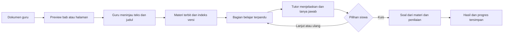

# Kontrak belajar terpandu, materi, dan pemulihan kuis

## Tujuan pengguna

Siswa memilih materi terbit, langsung mendapat pengajaran audio yang bertahap, bertanya atau menjawab, kemudian memilih lanjut belajar atau kuis. Saat kuis aktif, aksi belajar lain ditahan. Keluar, reload atau berpindah perangkat tidak menghapus sesi/soal/jawaban yang telah tersimpan.

Guru perlu pintu masuk upload yang jelas. Admin perlu katalog dan kontrol materi. Perubahan UI bersama menunggu Antigravity selesai; backend dan pengujian kode dikerjakan lebih dahulu. Next.js, LangChain/LangGraph, OpenAI dan ElevenLabs tetap dipakai; tidak menambahkan Planner Agent.

Pembaruan pengguna: Antigravity sudah selesai. Integrasi UI dapat dilanjutkan, dengan review keseluruhan sebelum push. Tiga jalur berbeda tetap jelas:

| Jalur | Tujuan | Siklus |
| --- | --- | --- |
| Mini kuis Tutor | Mengecek pemahaman bagian yang baru diajarkan | Satu sampai tiga soal, feedback dan kembali belajar |
| Asesmen mandiri | Latihan lebih lengkap dari materi pilihan | Sesi terpisah, skor, analisis dan riwayat tersimpan |
| Tugas guru | Evaluasi kelas dari soal guru atau usulan AI | Draft, review guru, publikasi versi, penugasan, jawaban, submit dan hasil |

Mini kuis tidak membuat penugasan guru. Problem Generator untuk tugas menghasilkan draft yang harus direview sebelum siswa mengerjakan. Sumber, kepemilikan, jawaban dan pemulihan sesi masing-masing jalur diperiksa server.

## Materi menjadi apa

Original PDF tidak otomatis dianggap konten yang sudah dapat diakses. Native text diambil, guru meninjau rumus/gambar/tabel, lalu publikasi. Bagian belajar berasal dari teks yang direview, bukan seluruh PDF mentah. Chunk RAG membantu pencarian sumber; tidak dianggap sebagai kurikulum mastery atau struktur subbab yang disetujui guru.

## Kontrak API

- `POST /quiz/start`: menerima pasangan `class_id/material_id`, memeriksa keanggotaan/publikasi/indeks, lalu menghasilkan soal yang grounded. Soal dan state kanonis disimpan sebelum respons. `concept_id` global tidak diterapkan sembarangan pada materi kelas yang belum dipetakan.
- `GET /quiz/active`: daftar sesi aktif milik siswa untuk pemulihan. `GET /quiz/sessions/{id}` mengembalikan soal saat ini, kemajuan, feedback terakhir, dan konteks yang aman; tidak mengirim kunci/rubrik/state internal.
- `POST /quiz/submit`: tetap memakai `submission_id`, transaksi dan receipt yang tahan retry/restart. Jawaban ganda tidak menambah nilai dua kali.
- `POST /learning/start`: pasangan kelas/materi; membuka atau melanjutkan sesi belajar terpandu versi materi. Penjelasan pertama otomatis dibuat dari sumber yang dipilih.
- `GET /learning/active`, `GET /learning/sessions/{id}`: memulihkan bagian, fase, jawaban Tutor, sumber dan kuis terkait.
- `POST /learning/sessions/{id}/actions`: aksi `question`, `continue`, `repeat`, `quiz`, atau `check`; memakai `request_id`, revision dan receipt untuk mencegah lanjut dua bagian karena retry. Selama kuis aktif, hanya pemulihan/penyelesaian kuis tersedia. Kuis yang selesai mengizinkan belajar/remediasi kembali.
- `GET /admin/materials`, `GET /admin/materials/{id}`: katalog semua materi kelas, pemilik, status, revisi, kesiapan indeks dan isi untuk admin.
- `PUT /admin/materials/{id}` dan `POST /admin/materials/{id}/index`: admin mengubah/terbitkan atau menyiapkan ulang dengan log aktivitas dan invalidasi indeks yang sama seperti alur guru. Guru tetap hanya mengelola kelas sendiri.

## Data dan batas sesi

- Tahap belajar, unit sumber, versi, giliran Tutor dan kuis terkait disimpan di PostgreSQL. LangGraph menjalankan pengajaran; cookie/localStorage bukan sumber kebenaran tahap/hasil kuis.
- Quiz state yang ada sudah durable. Tambahkan jalur read/recovery, jangan membuat cache browser sebagai pengganti.
- Respons belajar memberikan `available_actions`; UI hanya menampilkan tindakan yang sah. Browser tidak bisa dipaksa tetap terbuka. Tampilkan konfirmasi keluar dan jalur lanjut kuis saat kembali.
- Jika materi dicabut atau akses kelas hilang, jangan bocorkan konten lewat endpoint resume. Sesi tetap tersimpan untuk audit/pemulihan akses.
- Class-material mastery belum dipetakan ke Concept global. Nilai latihan dan aktivitas belajar disimpan; jangan mengarang atribusi mastery.
- Tidak mengisi kekurangan generasi AI dengan soal dummy atau jawaban `(open-ended)`. Kegagalan provider/kualitas menghasilkan status retry yang jelas; tidak membuat sesi kuis palsu.

## Pengujian

1. Materi terpilih sampai pengajaran otomatis, Q&A, lanjut/ulang, mini-check dan kuis.
2. Tutoring ID/EN menggunakan sumber yang sama meskipun bahasa materi berbeda.
3. Restore dengan graph/app baru; receipt retry; pembaruan revision dan percobaan aksi saat kuis aktif.
4. Ownership siswa, guru lain, draft, enrollment dicabut, indeks berubah dan kunci jawaban tidak bocor.
5. Soal nyata bersumber, generasi kosong/rusak/underfilled ditolak; provider mock dipisahkan dari acceptance OpenAI nyata.
6. Lint/types/build dan migration upgrade pada database terisolasi. Klik/perangkat dilakukan pengguna; VPS dan full UI integration tetap milestone berikutnya setelah pekerjaan Antigravity.
