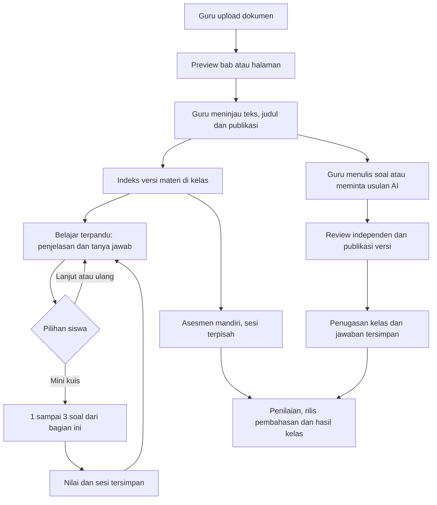

# Review Antigravity dan mapping scope KODMOD

> Status terbaru tersedia di [progres dan pengujian 5 Oktober 2026](scope-and-testing-2026-10-05.md). Angka 76% dan kondisi container dalam dokumen ini adalah snapshot sebelum paket penyelesaian berikutnya.

Tanggal: 4 Oktober 2026. Baseline: `ec1fd0c`; perbaikan hasil review: `2d08f9d`. Perubahan UI Antigravity dan integrasi Tutor berada dalam checkout yang sama; review mencakup hasil gabungannya.

Dokumen ini menggantikan ringkasan status lama untuk keputusan pekerjaan berikutnya. Pemeriksaan dilakukan melalui source, tes kode/API, PostgreSQL terisolasi, build, dan pemeriksaan container. Tidak melakukan klik browser atau menguji perangkat bantu milik pengguna.

## Kesimpulan

Fondasi produk dan tiga jalur belajar sudah tersedia di kode. Seluruh scope belum selesai. Image Docker yang sedang berjalan tertinggal dari checkout; kesehatan container tidak berarti versi fitur terbaru sudah aktif.

Estimasi implementasi **76%** menggunakan 23 area pada tabel berikut: **14 tersedia**, **7 parsial**, **2 belum selesai**. Perhitungan berbobot sama: `(14 + 7 × 0,5) / 23`. Ini indikator cakupan kode, bukan persentase kesiapan produksi, kualitas pedagogi AI, atau waktu yang tersisa. Status tersedia tetap memerlukan acceptance provider dan perangkat yang relevan.

## Hasil review dan investigasi

| Temuan | Dampak | Hasil |
| --- | --- | --- |
| P1: aturan Git `materi/` cocok dengan semua direktori bernama materi | Halaman `/admin/materi`, detailnya, dan `/guru/materi` tersedia lokal tetapi tidak masuk commit | Dibatasi menjadi `/materi/`; halaman aplikasi disertakan. PDF pengguna di root tetap di luar Git |
| P1: JSON tahap awal Tutor berubah pada objek yang sama sesudah flush | Respons pertama berisi penjelasan, tetapi membuka sesi kembali menghasilkan teks kosong | Snapshot awal disalin sebelum pengajaran. Restore dan dua start bersamaan diuji pada PostgreSQL |
| P1: start belajar belum melakukan commit sebelum memberi respons berhasil | Respons berhasil dapat terkirim sebelum kegagalan penyimpanan diketahui | Commit dilakukan sebelum respons; kegagalan awal/action dan retry diuji pada database terisolasi |
| P2: grafik memberi kategori nol lebar/tinggi minimum, persentase admin dihitung dari sisa | Komposisi dan aktivitas tidak sepenuhnya mewakili data | Rasio dihitung dari jumlah tiap peran; kategori nol mempunyai ukuran nol |
| P2: menyetel ulang password melalui form admin juga mengirim role lama | Audit mencatat `user.role_changed` walaupun role tidak berubah | Klasifikasi memakai perubahan aktual; tes HTTP memastikan `user.password_reset` tanpa menyimpan password di metadata |
| P1 untuk pengujian pengguna: Docker masih memakai versi lama | Endpoint belajar terpandu, recovery, proposal soal dan katalog materi baru belum tersedia di API yang sedang berjalan | Diverifikasi lewat OpenAPI dan `alembic current`. Rebuild dan migrasi lokal menjadi langkah berikutnya |

Tambahan yang sudah ditelusuri:

- Admin mempunyai grafik, daftar/detail pengguna, reset password, aktif/nonaktif, hapus akun dengan konfirmasi, log persisten, filter kategori, pemantauan provider dan review kuis.
- Pemantauan AI saat ini mengembalikan penggunaan OpenAI dan riwayat request sebagai belum tersedia. Jumlah sesi bukan bukti jumlah token atau latensi provider. Kuota ElevenLabs mempunyai endpoint nyata, tetapi telemetry setiap request belum tersimpan.
- Kuis tidak memakai soal pengganti dummy jika generasi kosong, tidak lengkap atau tidak sesuai kontrak. Pengguna mendapat kegagalan yang bisa dicoba kembali.
- Sumber kelas diperiksa berdasarkan kepemilikan, enrollment, publikasi, kesiapan indeks dan versi. Bahasa jawaban ID/EN tidak membatasi bahasa sumber.
- Pemulihan kuis tidak mengirim jawaban benar, rubrik atau graph state ke siswa. Pengiriman ganda memakai receipt tersimpan; penilaian dan progres tidak ditambahkan dua kali.
- Percobaan tugas guru, asesmen mandiri dan mini kuis Tutor mempunyai penyimpanan serta lifecycle masing-masing.

## Mapping seluruh scope

“Tersedia” berarti jalur utama ada pada source dan memiliki pemeriksaan yang relevan. “Parsial” berarti ada batas produk atau acceptance yang masih terbuka. Bukti tes menggunakan provider simulasi kecuali dinyatakan nyata.

| # | Area | Status implementasi | Sudah ada | Sisa utama / bukti |
| --- | --- | --- | --- | --- |
| 1 | Landing, brand dan navigasi | Tersedia | Tema biru, halaman informasi, navigasi, placeholder gambar | Source `apps/web/src/app/page.tsx`; penilaian visual/responsif oleh pengguna |
| 2 | Registrasi, login, role, logout | Tersedia | Registrasi siswa/guru tanpa kode undangan, cookie HttpOnly, gate role dan konfirmasi keluar | Tes HTTP auth. JWT individual/password-reset session revocation belum menjadi fitur yang lengkap |
| 3 | Kelas guru dan keanggotaan | Tersedia | Buat/edit/arsip kelas, roster dan pembatasan akses | `api/routes/classrooms.py`, tes kelas dan editorial |
| 4 | Upload dan pengelolaan materi guru | Tersedia | Menu Materi saya, memilih kelas tujuan, import/editor, review teks dan publikasi | `/guru/materi`, `class-forms.tsx`; katalog guru dibatasi 200 item, pagination berikutnya diperlukan untuk skala besar |
| 5 | Buku panjang dan modul pendek | Tersedia | Preview bab/rentang halaman; modul pendek bisa satu materi | Empat PDF lokal pernah diuji: Biology, Matematika, Pancasila dan modul SD. Batas 150 halaman/100.000 karakter per materi; rincian di laporan import |
| 6 | Materi admin | Tersedia | Katalog, pencarian, pagination, isi materi, edit/publikasi, reindex dan audit | `/admin/materi`, `api/routes/admin_materials.py`, tes HTTP isolasi |
| 7 | Indeks dan RAG materi privat | Parsial | Chunk versi, pgvector, akses siswa, invalidasi/retry dan konteks sumber | Belum antrean job durable, penyimpanan dokumen asli serta lineage halaman lengkap |
| 8 | Tutor belajar terpandu | Tersedia | Pilih materi, otomatis mengajar, tanya jawab, ulang/lanjut, selesai, SQL restore | `graphs/guided_learning.py`, `api/learning_service.py`, `guided-tutor.tsx`; kualitas pengajaran nyata masih perlu acceptance |
| 9 | Mini kuis Tutor | Tersedia | Cek satu soal atau mini kuis tiga soal; aksi belajar ditahan sampai selesai | Source unit yang sedang dipelajari, skor/feedback dan kembali belajar. Tes restore dan penuntasan tiga soal |
| 10 | Asesmen mandiri | Tersedia | Materi pilihan, jumlah/tantangan soal, penilaian, feedback, sesi aktif dan recovery | `/siswa/latihan`, `assessment_service.py`, tes transaksi PostgreSQL |
| 11 | Penyusunan kuis guru | Tersedia | MCQ manual dan usulan AI dari materi guru ke editor | Usulan wajib diperiksa/disimpan; tidak langsung terbit. Kontrak kualitas/source diuji, provider nyata belum dievaluasi |
| 12 | Review dan publikasi kuis | Tersedia | Reviewer independen/admin, approve/reject, revisi dan versi terbit yang tetap | Review diri sendiri dilarang; capability/revisi/overlap diuji |
| 13 | Penugasan dan pengerjaan siswa | Tersedia | Jadwal, satu percobaan, jawaban tersimpan, resume, submit, hasil, kebijakan rilis pembahasan | `/siswa/tugas`, hasil kelas guru, idempotency dan revision PostgreSQL. Esai belum menjadi jenis tugas yang didukung |
| 14 | StudentModel dan pemetaan konsep | Parsial | Mastery global, analytics/rekomendasi; skor materi kelas disimpan | Relasi Subject kanonis dan pemetaan material → Concept yang disetujui guru belum tersedia. Nilai kelas tidak boleh otomatis diklaim sebagai mastery konsep global |
| 15 | Dashboard, pengguna, analytics dan log admin/guru | Tersedia | Ringkasan, grafik, operasi akun, audit metadata persisten, filter, hasil penugasan | Log bukan rekaman setiap klik; penilaian MCQ formal deterministik. Analisis pedagogi/export lebih lengkap bukan acceptance yang sudah selesai |
| 16 | Pemantauan penggunaan AI | Parsial | Konfigurasi model, kuota ElevenLabs nyata, tampilan status tak tersedia | Token/latensi/biaya per request OpenAI, kegagalan dan aggregation usage belum diinstrumentasi |
| 17 | Suara Tutor/menu dan cache | Tersedia | Bian v2, STT adapter, app/device choice, suara menu ON, hover/focus, kontrol suara, cache server/browser dan warmup CLI | Suara menu independen dari Tutor. TTS nyata dan cache pernah diuji; warmup semua menu belum dijalankan. Scribe/live microphone dan autoplay HP belum acceptance |
| 18 | Bahasa Indonesia/Inggris | Parsial | Pilihan bahasa tersimpan, konfirmasi suara sesuai bahasa, instruksi Tutor/soal dan copy utama | Copy baru admin, label dinamis, dialog interpolasi dan authored-content language masih perlu audit penuh; tidak menganggap seluruh aplikasi sudah bilingual sempurna |
| 19 | Aksesibilitas tunanetra/low vision | Parsial | Skip link, label/keyboard dasar, onboarding suara, navigasi geser opsional, reader size/spacing/contrast | Preferensi low vision masih di pembaca, belum global. Dropdown profil memakai role menu tanpa navigasi panah/focus awal yang lengkap. NVDA/TalkBack/VoiceOver/reflow belum diuji |
| 20 | Konsistensi shadcn dan UI | Parsial | Button/Card/Switch dengan gaya KODMOD; tema dan shell bersama | Banyak form, tabel, modal/profile menu masih komponen custom lama. Belum migrasi semua komponen ke primitive shadcn atau audit visual semua halaman |
| 21 | OCR dan provenance dokumen | Belum selesai | Import native-text PDF/dokumen tersedia | PDF scan memerlukan OCR. Penyimpanan original, nomor halaman/citation, hasil OCR yang ditinjau dan worker durable belum selesai |
| 22 | Docker lokal dan VPS | Parsial | Empat service utama healthy; Compose prod/Caddy/volume tersedia | Docker aktif masih 0006; checkout menuju 0008. Image terbaru/migrasi lokal, VPS/domain/TLS/backup-restore/load acceptance belum selesai |
| 23 | Acceptance end-to-end nyata | Belum selesai | Tes kode/API, transaksi DB dan build tersedia | Belum acceptance menyeluruh dengan OpenAI nyata, Scribe, data nyata, perangkat/AT, dan VPS. Pengguna mengerjakan pengujian klik |

## Jalur materi sampai siswa

Guru menentukan materi yang layak dipakai. Buku panjang dapat dipisah per bab; satu modul/subbab dapat disimpan langsung. Bagian Tutor saat ini membagi teks hasil review secara berurutan sekitar 2.400 karakter dan mempertahankan seluruh teks. Ini bukan hierarki kurikulum/subbab semantik yang telah disahkan guru. RAG memilih konteks untuk generasi; indeks tidak otomatis menetapkan Concept atau mastery.

LangChain dan LangGraph tetap digunakan. Belajar terpandu menjalankan graph pengajaran yang jelas; mini kuis memakai layanan asesmen tersimpan. Planner Agent tidak ditambahkan. API key berada pada backend.

## Bukti validasi terbaru

- Backend gabungan final: **406 passed**, dengan delapan warning deprecation/test config. Provider pada suite ini disimulasikan; mencakup regresi reset password dan commit/restore Tutor yang ditemukan pada review.
- Frontend: **112 passed, 2 skipped** pada fixture loopback terisolasi, tanpa klik browser. Dua skip adalah alur editorial lewat Next proxy dengan backend editorial nyata yang belum diaktifkan pada run ini; bukan hasil lulus. Tes backend editorial dan transaksi PostgreSQL dijalankan terpisah.
- PostgreSQL: **16 passed** untuk guided learning, editorial dan assessment transactions pada port 5434, dengan schema/database sementara. Database aplikasi port 5433 dan shared Redis tidak dipakai untuk tes ini.
- Migrasi: instalasi database kosong sampai `0008_audit_events`; upgrade/downgrade 0007; start/action bersamaan dan retry diuji. Data source asli tidak diganti atau dihapus.
- Next.js production build Windows, typecheck dan lint berhasil. Build memuat halaman materi admin/guru yang sebelumnya tersembunyi dari Git. Build Linux Docker untuk perubahan review ini belum dijalankan.
- `npm audit --omit=dev`: **0 advisory runtime**. Rantai ESLint/braces masih mempunyai advisory development yang terpisah; tidak melakukan downgrade major paksa.
- GET kuota ElevenLabs menggunakan konfigurasi lokal nyata: **configured=true, available=true**. Ini memverifikasi akses endpoint kuota, bukan semua jenis audio atau pengajaran.
- Docker: web 3100, API 8109, PostgreSQL 5433 dan Redis healthy; API container masih schema `0006_editorial_quizzes`. OpenAPI container belum mempunyai lima endpoint baru: learning/start, quiz/active, teacher/quizzes/propose, admin/materials, admin/insights/ai-usage.

Catatan: tidak mengklaim build/source/fixture sebagai bukti tampilan visual, suara benar-benar terdengar, pedagogi benar, atau kesiapan VPS.

## Pekerjaan berikutnya, berdasarkan ketergantungan

| Prioritas | Paket | Kriteria selesai |
| --- | --- | --- |
| 1 | Sinkronkan Docker lokal | Backup DB, rebuild web/API, migrasi 0007–0008, semua service healthy; route terbaru dan auth berfungsi lewat API/Next proxy |
| 2 | Acceptance alur inti dengan provider nyata | Import satu bab dan satu modul, review/terbit, indeks nyata, Tutor ID/EN, Q&A, mini kuis, asesmen mandiri dan tugas guru; restart/resume; TTS/cache/STT dan kegagalan provider tercatat |
| 3 | Subject dan Concept yang direview | Guru memetakan konsep ke versi materi; publikasi/revisi mengatur invalidasi; hasil kuis mengubah mastery hanya pada konsep sah dan historisnya dapat dijelaskan |
| 4 | Aksesibilitas dan konsistensi UI | Prioritaskan menu profil, dialog, Select/Input/Table dan reader global menggunakan shadcn/custom theme; label/focus, translate copy, kontras/reduced motion/reflow diperiksa |
| 5 | OCR dan import durable | Scan → OCR + provenance halaman → review guru → publikasi; pekerjaan bertahan saat API restart dan bisa retry tanpa duplikasi |
| 6 | Telemetry dan persiapan VPS | Request usage nyata, latency/error/biaya; deployment TLS, secrets, backup-restore rehearsal, monitoring dan smoke test di VPS |
| 7 | Acceptance perangkat oleh pengguna | Windows/NVDA, Android/TalkBack, iPhone/VoiceOver; keyboard/geser, double speech, mic permission, reload kuis, 200% teks dan reflow 320px/400% |

Publikasi/push ditahan sampai hasil pemeriksaan ini ditinjau dan paket yang menjadi syarat rilis benar-benar divalidasi. Commit progres tetap memakai `feat: ...` tanpa trailer atribusi.

Referensi: [hasil import empat PDF](material-import-validation-2026-10-04.md), [kontrak belajar terpandu](plans/2026-10-04-guided-learning-contract.md), [prioritas teknis](superpowers/plans/2026-10-04-technical-priorities.md), [deployment](DEPLOYMENT.md).
